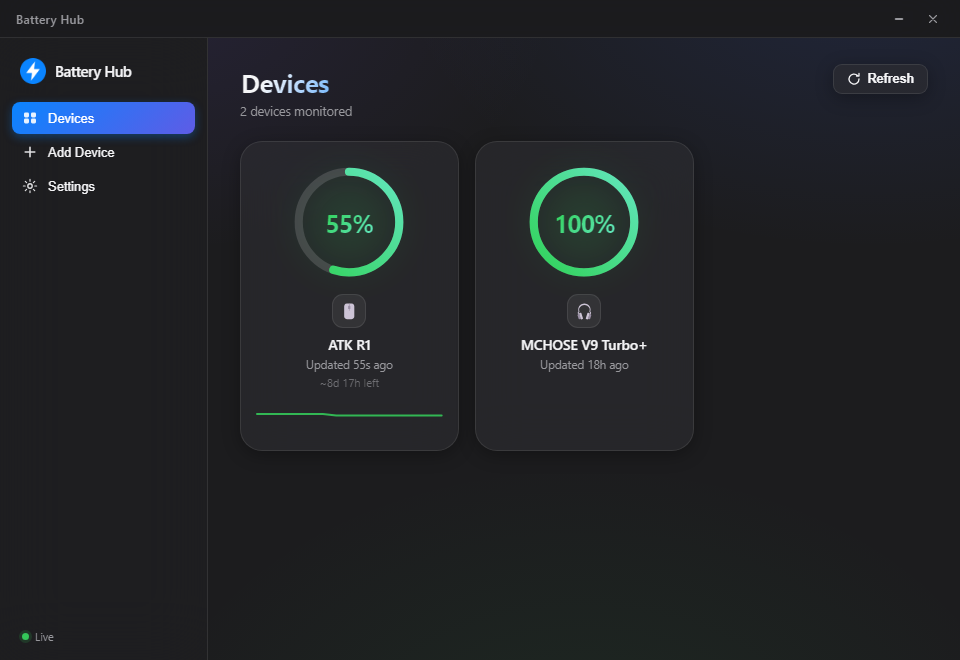

<div align="center">
  
  <h1>Battery Hub</h1>
  <p>A clean, live battery monitor for your wireless devices on Windows — mice, keyboards, headsets and controllers, all in one place.</p>
</div>



Each device gets a card with its charge level, a colour-coded ring, a mini history graph, a rough **“time left”** estimate, and its own **battery icon in the system tray**. You also get low-battery notifications, light/dark themes, and drag-to-reorder cards.

---

## 📥 Tutorial 1 — Install it

1. Go to the **[latest release](../../releases/latest)** and download **`Battery Hub Setup x.y.z.exe`**.
2. Double-click it to run.
3. Windows will likely show a blue **“Windows protected your PC”** box. This only appears because the app isn’t code-signed (a paid certificate) — it is **not** a virus. Click:
   - **More info** → **Run anyway**
4. It installs just for you (no admin needed) and adds **Start-menu** and **Desktop** shortcuts.
5. Launch **Battery Hub**. That’s it — you’ll land on the **Devices** screen.

> To uninstall later: *Windows Settings → Apps → Battery Hub → Uninstall*.

---

## 🔌 Tutorial 2 — Add your first device

Click **Add Device** in the sidebar.

**If your device is recognised**, it shows an *auto-detected* badge — just click **Add**. Done.

**If it isn’t recognised**, click **Calibrate & Add** and follow the 30-second scan:

1. Press **Start 30-second Scan**.
2. **While it’s scanning, turn the device off and back on** (once or twice). Many wireless devices only report their battery the moment they power on — this is the surest way to catch it.
3. When the scan finishes, it shows the numbers the device sent. **Click the one that matches your current battery %** (usually a value between 0 and 100).
4. If that number isn’t exactly your battery % (some devices report a different scale), tick the box and type your real % — the app will convert it automatically from then on.
5. Click **Save & Add Device**.

Your device now appears on the **Devices** screen and updates on its own.

---

## 🔋 Tutorial 3 — Read your batteries

Each card tells you everything at a glance:

| What you see | What it means |
| --- | --- |
| **Big % + ring** | Current charge. **Green** = healthy, **yellow** = getting low, **red** = low. |
| **⚡ Charging pill** | The device is plugged in / charging (the ring pulses green). |
| **Thin line at the bottom** | A **sparkline** of the recent battery trend. Appears once a little history builds up. |
| **“~8d 17h left”** | A rough estimate of time remaining, based on how fast it’s draining. |
| **“Updated 55s ago”** | When the last reading came in. |

**System tray:** every device also shows a little **battery icon** near the clock (click the `^` arrow if Windows hides it). It fills up and changes colour with the charge, so you can check without opening the app. Click it to open Battery Hub or quit.

**Notifications:** when a device drops below your threshold, Windows pops a low-battery alert (once per drop).

---

## ⚙️ Tutorial 4 — Make it yours (Settings)

Open **Settings** in the sidebar:

- **Theme** — System, Light, or Dark.
- **Accent colour** — pick the highlight colour.
- **Card density** — *Detailed* (big cards) or *Compact* (fit more on screen).
- **Low-battery alerts** — turn on/off and set the % threshold.
- **Tray battery icons** — show/hide the per-device tray icons.
- **Close to tray** — closing the window keeps it running quietly in the tray.
- **Launch at login** / **Start minimized** — have it start with Windows.
- **Refresh interval** — how often devices are re-checked.

**Handy extras:**
- **Drag** a card to reorder your devices.
- Click the **⋯** menu on a card to **Rename**, **Refresh now**, or **Remove** it.

---

## 🧯 Troubleshooting

- **“Can’t read this device’s battery.”** Some devices block battery requests at the driver level — unfortunately those can’t be read.
- **A headset won’t show up.** MCHOSE-style headsets need **Python** with the `hid` module installed (`pip install hid`). Mice/keyboards/controllers don’t need this.
- **Nothing captured during a scan?** Run it again and be sure to **turn the device off and on** while it scans.
- **It crashed?** A log is kept at `%APPDATA%\battery-hub\battery-hub.log` — helpful for reporting issues.

---

## 🛠️ Build from source (for developers)

Requires [Node.js](https://nodejs.org).

```bash
npm install
npm start        # run the app in dev mode
npm run dist     # build the Windows installer into dist/
```

- **`src/main`** — Electron main process: HID polling, tray, notifications. Native `node-hid` runs in an isolated `utilityProcess` so a driver crash can’t take the app down.
- **`src/renderer`** — the UI.
- **`src/main/hid/drivers`** — per-device battery drivers.
- **`scripts/make-icon.js`** — regenerates the app + tray icons.

## License

[MIT](LICENSE) © 2026 DORON177
