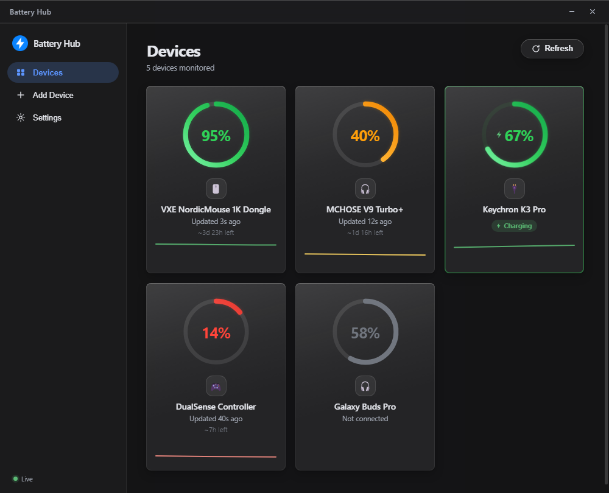

<div align="center">
  
  <h1>Battery Hub</h1>
  <p><strong>Live battery monitoring for wireless mice, keyboards, headsets and controllers on Windows.</strong></p>

  <a href="https://github.com/DORON177/battery-hub/releases/latest"></a>
  <a href="https://github.com/DORON177/battery-hub/releases"></a>
  <a href="LICENSE"></a>
  
</div>

---

Battery Hub reads the battery level of your wireless HID devices and shows each one on a live dashboard, with a per-device indicator in the system tray. Built with Electron.

<p align="center">
  
  <br />
  <sub>The dashboard, shown with sample devices. Regenerate with <code>npx electron scripts/screenshot.js</code>.</sub>
</p>

## Features

- **Multi-device dashboard** — mice, keyboards, headsets and controllers, each with a colour-coded charge ring.
- **System-tray icons** — a live battery indicator per device beside the clock.
- **History & estimates** — a recent-trend sparkline and a *time-left* estimate derived from the drain rate.
- **Low-battery notifications** — Windows alerts when a device falls below a configurable threshold.
- **Guided calibration** — a 30-second scan detects the battery byte for devices that aren't recognised automatically.
- **Liquid-glass interface** — translucent Windows 11 acrylic design with light/dark themes and a reduce-motion option.
- **Auto-updates** — delivered through GitHub Releases.

## Installation

Download the latest `Battery Hub Setup x.y.z.exe` from the [releases page](https://github.com/DORON177/battery-hub/releases/latest) and run it. Battery Hub installs per-user and requires no administrator rights.

Windows SmartScreen shows a **"Windows protected your PC"** prompt because the installer isn't code-signed — select **More info → Run anyway**. Code signing certificates are issued to identified publishers for a recurring fee; this project is unfunded, so builds are unsigned. See [Verifying a download](#verifying-a-download) if you'd like to confirm the file's integrity first.

### Verifying a download

Every release is built and published by [GitHub Actions](.github/workflows/release.yml) directly from a tagged commit — no binaries are uploaded by hand — and each one ships a `SHA256SUMS.txt`. To confirm your download matches, run:

```powershell
(Get-FileHash "Battery-Hub-Setup-1.1.5.exe" -Algorithm SHA256).Hash
```

and compare the result with the checksum in that release's `SHA256SUMS.txt`. Pasting the same hash into [VirusTotal](https://www.virustotal.com/gui/home/search) will show any scan results for the exact file.

## Usage

### Adding a device

Open **Add Device**. Recognised devices show an *auto-detected* badge — click **Add**. Otherwise choose **Calibrate & Add**:

1. Start the 30-second scan.
2. Power the device off and on while it scans — many wireless devices only report their battery on power-up.
3. Select the value that matches your current battery percentage.
4. If the device reports on a different scale, enter your real percentage and it's converted automatically from then on.

### Reading a card

Each card shows the current percentage and ring (green / yellow / red), a charging indicator, a history sparkline, an estimated time remaining, and the age of the last reading. Every device also appears as a tray icon that fills and changes colour with the charge.

### Settings

Theme and accent colour, card density, reduce animations, low-battery threshold, tray behaviour, launch at login, and refresh interval.

Devices can be renamed, given a custom icon, dragged to reorder, or **hidden** from the ⋯ menu. Hiding keeps the device and its calibration but stops polling and removes its tray icon; hidden devices are listed below the grid and can be restored at any time.

## Build from source

Requires [Node.js](https://nodejs.org).

```bash
npm install
npm start        # run in development
npm run dist     # build the Windows installer into dist/
```

## Project structure

| Path | Purpose |
| --- | --- |
| `src/main` | Electron main process — HID polling, tray, notifications, updates. |
| `src/main/hid/drivers` | Per-device battery drivers. |
| `src/renderer` | Application UI. |
| `scripts` | Icon generation and build tooling. |

Native `node-hid` runs in an isolated utility process, so a driver fault can't bring the app down.

## Troubleshooting

- **"Can't read this device's battery."** Some devices block battery requests at the driver level and can't be read.
- **Nothing captured during calibration.** Rerun the scan and power the device off and on while it runs.
- **Crash logs** are written to `%APPDATA%\battery-hub\battery-hub.log`.

## License

[MIT](LICENSE) © 2026 DORON177
